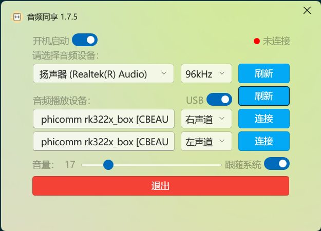
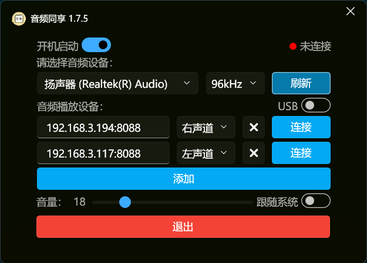
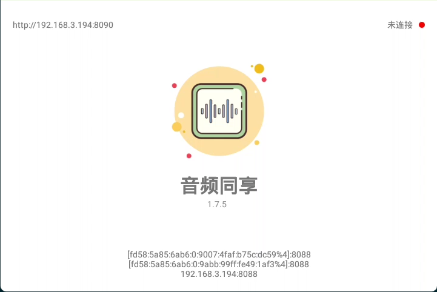
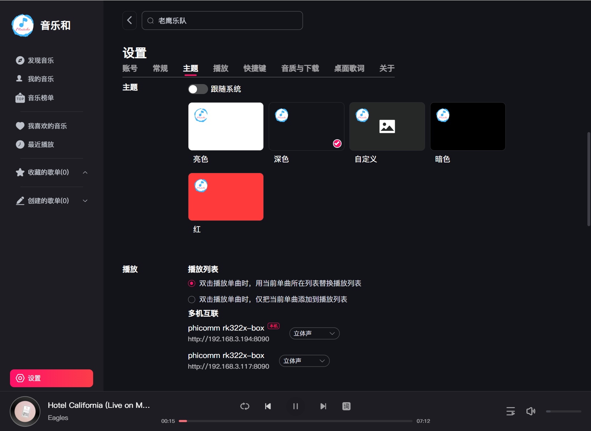

# AudioShare - 将 Windows 音频实时分享到安卓设备

[English](./README.en.md) | 简体中文

AudioShare 是一款可以让您将 Windows 电脑的声音实时传输到安卓设备播放的应用。它支持多台安卓设备同时连接，并可以根据不同声道播放不同的声音。您可以通过 USB 数据线或 Wi-Fi 网络连接您的设备。

## 功能特色

+ 实时传输: 将 Windows 电脑的声音实时传输到安卓设备，延迟低，音质高。
+ 多设备支持: 支持多台安卓设备同时连接，可根据不同声道播放不同的声音。
+ 两种连接方式: 支持 USB 数据线和 Wi-Fi 网络连接。
+ 远程控制: 支持远程控制播放云端音乐，使用 Musiche 项目，支持网易云、QQ、咪咕音乐播放。
+ 多机互联: 支持远程播放时多设备同步播放，可在设置界面禁用或开启。

## 使用教程

### Windows 端

1. 从 [Release页面](https://github.com/HeHang0/AudioShare/releases/latest) 下载 AudioShare.exe、AudioShare.apk、adb.exe、AdbWinApi.dll、AdbWinUsbApi.dll（如果仅用于wifi连接或已经安装adb可忽略后面三个adb相关文件）。
2. 打开 AudioShare.exe 软件。
3. 选择连接方式：
   + USB 连接: 将 Windows 电脑和安卓设备连接到同一根 USB 数据线。
   + Wi-Fi 连接: 确保 Windows 电脑和安卓设备连接到同一个 Wi-Fi 网络。
4. USB 连接: 选择 “USB 设备” 下拉菜单中的设备，然后点击 “连接” 按钮。
5. Wi-Fi 连接: 输入安卓设备的 IP 地址和端口号 (默认端口号为 8088)，然后点击 “连接” 按钮（使用WiFi连接时Windows端会自动检测当前局域网可用的Android设备）。
6. 连接成功后，您就可以在安卓设备上听到 Windows 电脑的声音了。

### Android 端

1. 有条件可手动安装app至Android设备（无法连接时Windows端会尝试安装）。
2. 如果手动安装可打开app查看远程管理地址及Windows远程连接地址。
3. 如果您使用的是 USB 连接，请等待应用自动安装。
4. 如果您使用的是 Wi-Fi 连接，请确保您的 Windows 电脑和安卓设备连接到同一个 Wi-Fi 网络。
5. 连接成功后，您就可以在安卓设备上听到 Windows 电脑的声音了。

## 高级功能

### 斐讯R1氛围灯

1. 授权app获取Android root权限。
2. 重启app后生效。
3. 可多设备同步氛围灯效果。

### 远程控制播放云端音乐

1. 访问Android app界面左上角上显示的远程管理地址，默认端口为8080（斐讯R1为8090）。
2. 打开远程管理页面可在设置界面选择登录网易云、QQ、咪咕音乐账号来查看个人歌单。
3. 详细介绍可见[Musiche项目](https://github.com/HeHang0/Musiche)。

### 多机互联

1. 在多个安卓设备上安装 AudioShare 应用。
2. 在所有设备上打开 AudioShare 应用后会自动发现局域网设备并连接
3. 默认会自动连接并同步播放，如需禁用多机互联功能可在设置界面关闭。

### 下载

+ [最新版本](https://github.com/HeHang0/AudioShare/releases/latest)
